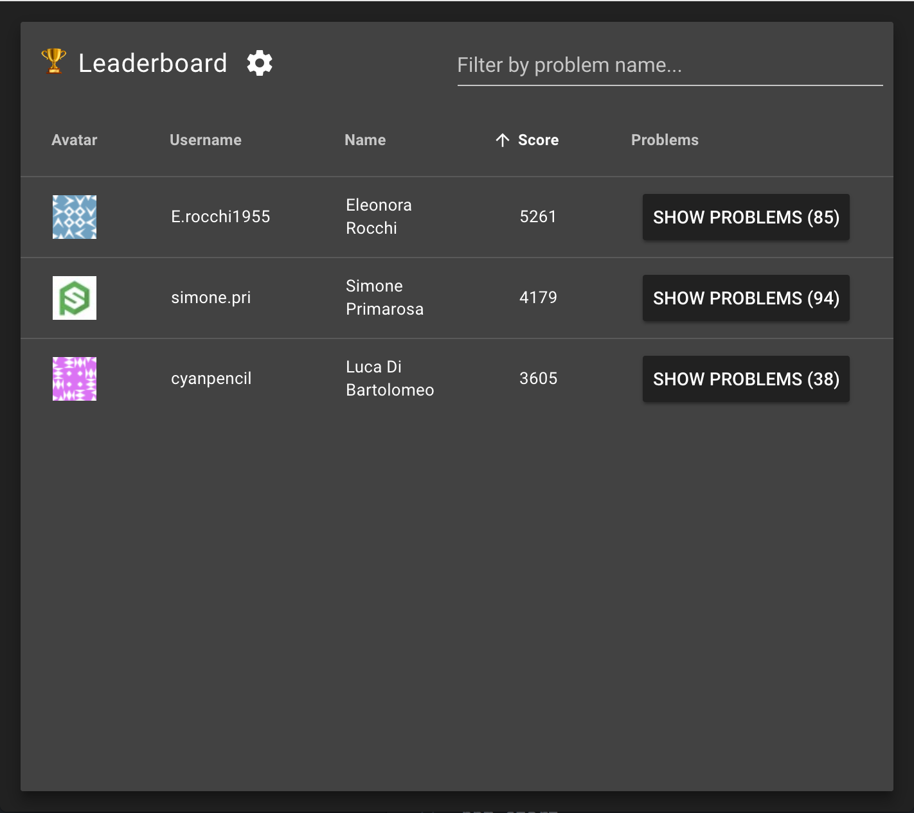
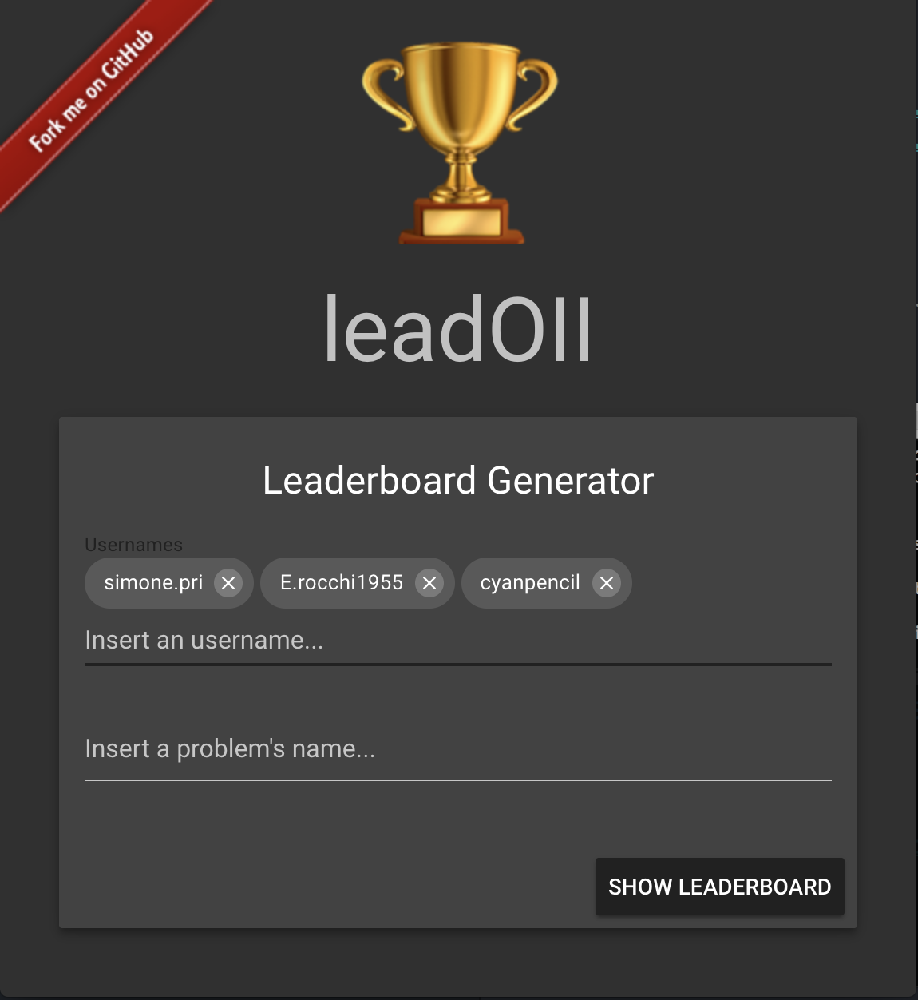
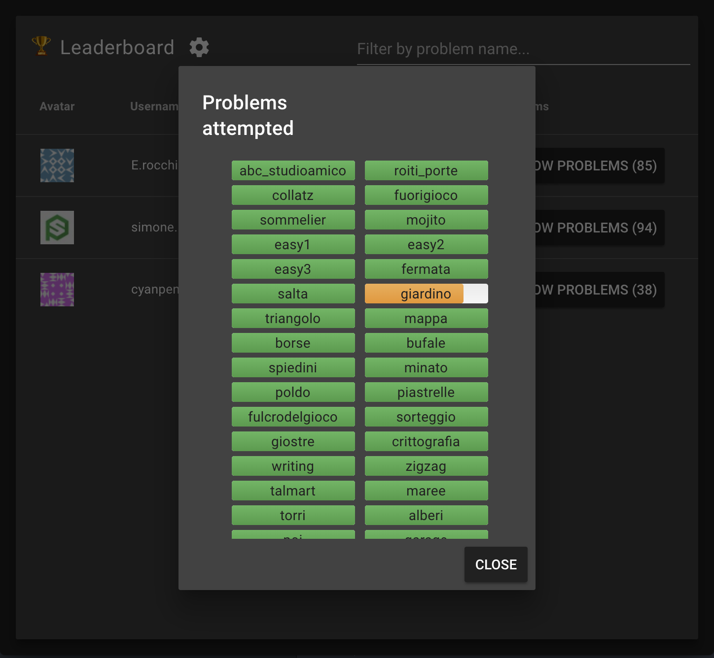

<h1 align="center">
  <b>leadoii</b>
</h1>
<p align="center">
  <!-- License - MIT -->
  <a href="https://github.com/simonepri/leadoii#license">
    
  </a>
</p>
<br />
<p align="center">
  🏆 Leaderboard Generator for the Italian Olympiads of Informatics Training Platform
</p>
<p align="center">
  <sub>
    Coded with ❤️ by <a href="#authors">Simone Primarosa</a>.
  </sub>
</p>
<br/>

<p align="center">
  <a href="https://leadoii.now.sh">
    
    
    
  </a>
</p>

## Reasoning
This project is aimed to generate leaderboards based on the data from the [Italian Olympiads of Informatics Training Platform](https://training.olinfo.it/#/ranking/1).  
You can choose the name of the users that you want the leaderboard generated for and optionally the problems you want to consider inside the leaderboard score calculation.

You can use the generator by going to this website [https://leadoii.now.sh](https://leadoii.now.sh
).
> The website may be really slow sometimes due to [now.sh free hosting limitations](https://zeit.co/docs/other/faq#why-does-my-deployment-occasionally-have-long-response-times).  
> Please be patient!

Do you believe that this is *useful*? It has *saved you time*? Or maybe you simply *like it*?  
If so [support us with a Star ⭐️](#start-of-content).

## Development
If you want to run it locally you just need to run the following commands.

```bash
git clone https://github.com/simonepri/leadoii.git
cd leadoii

cd backend
npm i
npm start
cd ..

cd frontend
npm i
npm run serve
cd ..
```

## Authors
- **Simone Primarosa** -  *Follow* me on *Github* ([:octocat:@simonepri](https://github.com/simonepri)) and on  *Twitter* ([🐦@simonepri](http://twitter.com/intent/user?screen_name=simoneprimarosa))

See also the list of [contributors](https://github.com/simonepri/node-package-skelethon/contributors) who participated in this project.

## License
This project is licensed under the MIT License - see the [LICENSE](https://github.com/simonepri/node-package-skelethon/LICENSE) file for details.
